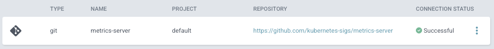
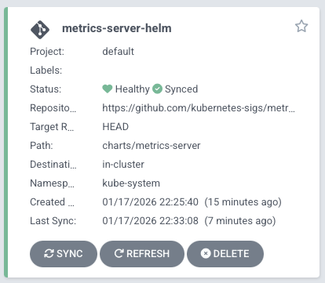

# Using the Helm Chart via Argo CD Application

This method is often preferred for managing configurations like TLS settings or resource limits through values.yaml files.

## Add the Helm repository to Argo CD

First, ensure Argo CD is aware of the Helm chart repository. You can do this via the UI in **Settings > Repositories** or using the CLI:

```bash
argocd repo add https://kubernetes-sigs.github.io/metrics-server/ --name metrics-server-helm
```



## Create an Argo CD Application manifest

Define the Application in ArgoCD by applying the `kube\metrics-server-helm.yml` file. This chart is passing the `--kubelet-insecure-tls=true` parameter since there is no cert on this cluster.

```bash
kubectl apply -f kube\metrics-server-heml.yml
application.argoproj.io/metrics-server-helm created
```




Once installed and synced, the Metrics Server pod should be running and healthy in the `kube-system` namespace. You can verify the installation by checking node and pod metrics:

```bash
% kubectl get pods -n kube-system | grep metrics-server

metrics-server-helm-6495b8f7bc-4v946           1/1     Running   0          10m

% kubectl top nodes
NAME                   CPU(cores)   CPU(%)   MEMORY(bytes)   MEMORY(%)   
gwkc-1-control-plane   186m         2%       1756Mi          22%         
gwkc-1-worker          60m          0%       1143Mi          14%         
gwkc-1-worker2         40m          0%       961Mi           12%         
gwkc-1-worker3         47m          0%       1263Mi          16%         

% kubectl top pods -n phrases
NAME                       CPU(cores)   MEMORY(bytes)   
backend-7cf7b4bc6b-dj6jd   5m           58Mi            
backend-7cf7b4bc6b-hc6pn   3m           51Mi            
frontend-6444c965d-cm6tc   6m           56Mi            
frontend-6444c965d-pm69c   6m           58Mi            
frontend-6444c965d-w958j   5m           57Mi   
```

If these commands return CPU and memory usage data, the Metrics Server is installed and functioning correctly.
